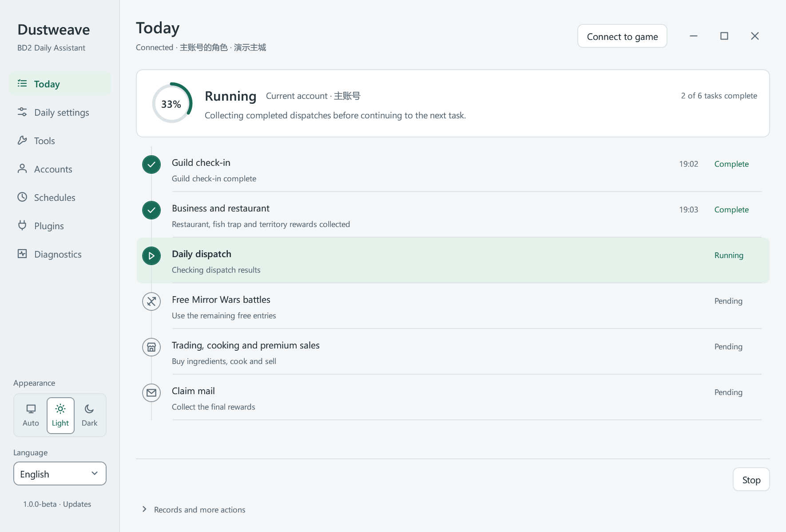
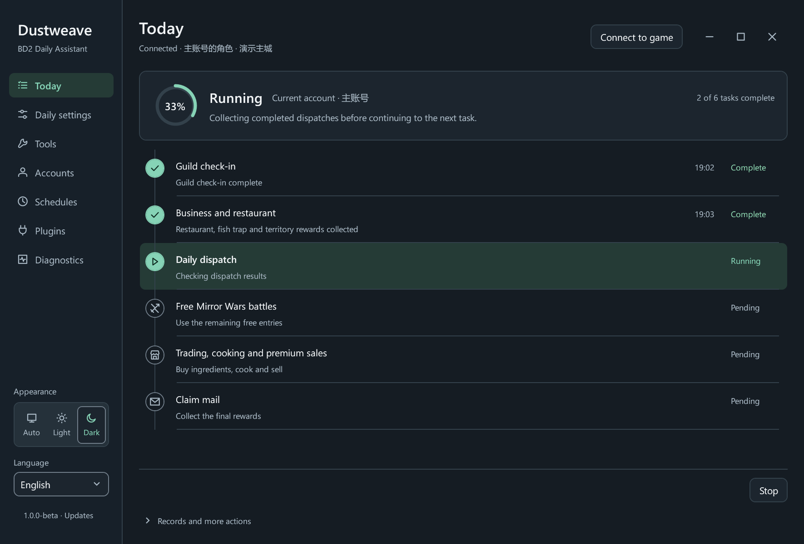

<div align="center">

# Dustweave · 织尘

**Your daily routine, woven into one timeline.**

A multi-account daily assistant for BrownDust II on Windows

[简体中文](README.md) · English

[](LICENSE) [](https://github.com/MadestSamurai/Dustweave/releases/latest)   

[Getting started](docs/GETTING_STARTED.en.md) · [Releases](https://github.com/MadestSamurai/Dustweave/releases) · [Report an issue](https://github.com/MadestSamurai/Dustweave/issues) · [Contributing](CONTRIBUTING.md)

</div>

> Provided free by **MadSamurai** on Bilibili ([MadestSamurai](https://github.com/MadestSamurai) on GitHub). This is an unofficial project. Automation may affect your account or game operation; understand the applicable rules before deciding to use it.

Dustweave brings account switching, daily and weekly tasks, resource management and minigames into one desktop workspace. Set up tasks for each account, review the current plan and follow its progress on a timeline. Disable tasks you do not need or rerun selected unfinished stages.

## Preview



<details>
<summary>Show the dark theme</summary>



</details>

Screenshots use fictional accounts in the application's isolated demo mode. The interface supports light, dark and system themes, as well as English.

## What it does

| Capability | What you can do |
| --- | --- |
| Multiple accounts | Save local account sessions, configure tasks per account and run selected accounts in order |
| Daily and weekly tasks | Check-ins, management rewards, free draws, hunting, dispatch, free Mirror battles, mission/pass rewards and mail collection |
| Maps and resource management | Enable weekly collection, NPC quests, stealing, trading, cooking and high-price sales as needed |
| A visible execution plan | Select stages, follow progress, review records and rerun unfinished work |
| One connection, integrated tools | Share the game connection and coordinate active automation so tasks do not compete for control |
| Scheduled runs and updates | Daily fixed times and account queues; signed background downloads with idle restart confirmation |
| Consistent language and appearance | Simplified Chinese, Traditional Chinese and English across the host and integrated tools |

Some stages require unlocked account content, an active event or a compatible game version. Optional plugins are supported; the interface shows available features.

### Toolbox

| Management and equipment | Minigames and draws |
| --- | --- |
| [Fishing](https://github.com/MadestSamurai/bd2-fishing) | [Sichuan](https://github.com/MadestSamurai/bd2-sichuan) · [Rhythm](https://github.com/MadestSamurai/bd2-rhythm) |
| [Territory](https://github.com/MadestSamurai/bd2-territory) | [Apostle Defense](https://github.com/MadestSamurai/bd2-apostle-defense) · [SECRET VISION](https://github.com/MadestSamurai/bd2-secret-vision) |
| [Equipment Assistant](https://github.com/MadestSamurai/bd2-equipment-assistant) | [Fiend Hunter](https://github.com/MadestSamurai/bd2-fiend-hunter) · [Infinite Gacha](https://github.com/MadestSamurai/bd2-infinite-gacha) |

Dustweave also includes a native [MANSION RUNAWAY](docs/MANSION_RUNAWAY.md) tool for realtime navigation and stage progression.

The tools listed in the table retain their independent projects. Within Dustweave, the host coordinates connections, language and automation ownership. Changing the host language does not overwrite a standalone tool's saved language preference.

## Download and start

For **Windows x64 and the native BrownDust II PC client**. Python is not required; Android emulators are not the target platform.

| Package | Choose it when | Requirement |
| --- | --- | --- |
| **Portable** | You want an extract-and-run package | Includes the .NET 8 desktop runtime |
| **Lite** | You already have the runtime and prefer a smaller download | [.NET 8 Desktop Runtime x64](https://dotnet.microsoft.com/en-us/download/dotnet/8.0) |

Both packages have the same features. Download a complete package from [GitHub Releases](https://github.com/MadestSamurai/Dustweave/releases). The domestic route is reserved for in-app OTA rather than first-install downloads. Then:

1. **Extract the entire folder** and run `Dustweave.exe`. Keep its data, flow and component directories alongside the executable.
2. Open the game normally, sign in and confirm the intended account in town. Exit the game normally and wait for the launcher to close, then choose **Save current account** in Accounts.
3. Use **Enter game** in the saved account row for future launches. Avoid the desktop game shortcut or an accelerator's launch button, which may start an elevated game; use only its acceleration service if needed.
4. Configure stages in daily settings, then start the selected tasks or account queue. Reopen **Connection guide** from Accounts at any time.

Start with a few familiar stages. The [getting-started guide](docs/GETTING_STARTED.en.md) covers updates, local data and troubleshooting. Install `1.0.1-beta` by extracting the complete download into a new folder; existing accounts and settings are reused. Older OTA clients cannot parse suffixed versions, so this release does not replace their feed. Subsequent compatible releases can use signed updates.

## Get help

Check [troubleshooting](docs/GETTING_STARTED.en.md#troubleshooting), then [open an issue](https://github.com/MadestSamurai/Dustweave/issues/new/choose). Include your version, the affected stage, expected and actual behavior, and reproduction steps. Attach only relevant diagnostic excerpts after checking for account identifiers or other personal information.

Do not upload account directories, credentials, complete inventories or replays. See [SECURITY.md](SECURITY.md) for security reporting.

## Contribute

Dustweave uses C#, .NET and WPF, with runtime-state observation, client adaptation and a shared game connection. The host does not depend on Python. Reproducible reports, translations, documentation improvements and focused fixes are welcome.

```powershell
git clone https://github.com/MadestSamurai/Dustweave.git
cd Dustweave
.\build.ps1
.\test.ps1 -NoBuild
.\check-source.ps1 -AfterBuild
```

Normal builds and synthetic tests neither require nor connect to the game. See the [development guide](docs/DEVELOPMENT.md) for prerequisites and packaging.

[Contributing](CONTRIBUTING.md) · [Architecture](docs/ARCHITECTURE.md) · [Test scope](tests/Dustweave.Tests/README.md) · [Changelog](CHANGELOG.md)

## License and acknowledgements

Dustweave is licensed under [MIT](LICENSE). Integrated tools and third-party components retain their respective licenses. The license grants no rights to game code, assets or trademarks. See [THIRD_PARTY_NOTICES.md](THIRD_PARTY_NOTICES.md) and the [dependency inventory](docs/DEPENDENCIES.md). Game content remains the property of its respective rights holders.

Thanks to the tool and dependency maintainers, testers, translators and users who provide reproducible reports. Dustweave is provided free and does not sell activation codes or paid licenses. Verify downloads through this repository and the author's own channels.

Upgrading from an earlier version: extract the complete package into a new folder and launch `Dustweave.exe`. Existing accounts, settings and history are reused without data migration. Keep old and new program files in separate folders.
