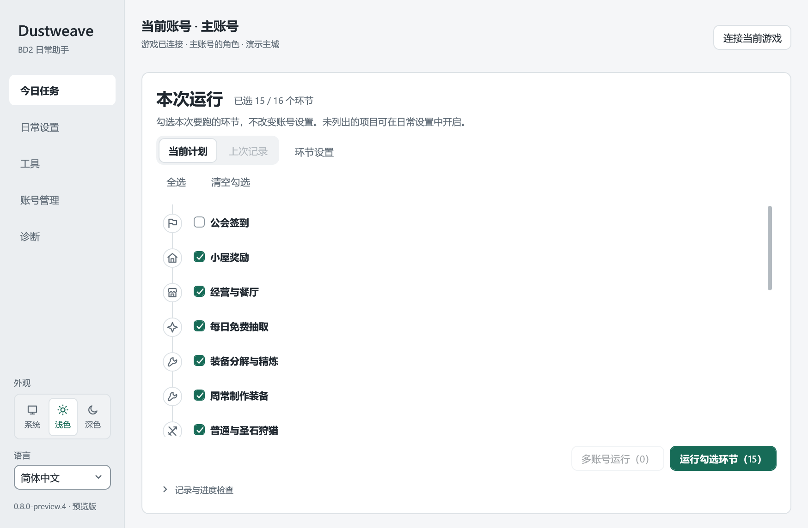
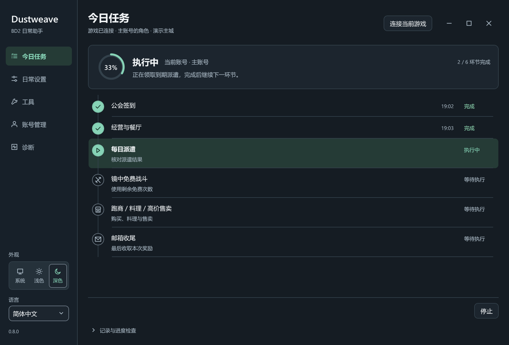

<div align="center">

# Dustweave · 织尘

**把琐碎日常，织成有序时间线。**

BrownDust II 多账号日常助手 · Windows 桌面应用

简体中文 · [English](README.en.md)

  

[开始使用](docs/GETTING_STARTED.md) · [版本发布](https://github.com/MadestSamurai/Dustweave/releases) · [问题反馈](https://github.com/MadestSamurai/Dustweave/issues) · [参与贡献](CONTRIBUTING.md)

</div>

> **受邀使用**：仓库目前保持私有。完整分发包可从下方国内线路下载；有仓库权限的用户也可使用 Releases。源码公开计划另行公布。
>
> 本项目由 B 站 **MadSamurai**（GitHub：[MadestSamurai](https://github.com/MadestSamurai)）免费提供，不隶属于游戏官方。辅助工具可能带来账号或游戏运行风险，请了解相关规则并自行决定是否使用。

织尘将账号切换、日常与周常、经营和小游戏收进同一个工作台。为每个账号选择需要的环节，查看本次计划，再沿时间线执行；不需要的环节可以关闭，未完成的部分可以单独重跑。

## 界面预览



<details>
<summary>查看深色界面</summary>



</details>

截图来自软件的隔离演示模式，使用虚拟账号；支持浅色、深色及跟随系统。

## 能做什么

| 能力 | 用法 |
| --- | --- |
| 多账号管理 | 保存本机账号会话，每个账号配置自己的任务，按选择顺序运行 |
| 日常与周常 | 签到、经营奖励、免费抽取、狩猎、派遣、镜中免费次数、任务与通行证奖励、邮箱收尾等 |
| 地图与经营 | 按需启用周收集、周 NPC 任务、偷窃、跑商、料理和高价售卖 |
| 清晰的执行计划 | 分环节显示进度，选择本次任务，查看记录，对未完成环节补跑 |
| 一次连接，多个工具 | 日常与内置工具共用连接；按自动化启用状态协调使用，避免同时操作游戏 |
| 定时执行与更新 | 固定时间、星期和账号队列；后台下载签名更新包，空闲时确认重启 |
| 全局语言与外观 | 简体中文、繁體中文、English；主窗口和内置工具统一切换语言 |

部分环节依赖账号已解锁的内容、当前活动或游戏版本。支持可选插件，界面按当前可用功能显示。

### 工具箱

| 经营与装备 | 小游戏与抽取 |
| --- | --- |
| [自动钓鱼](https://github.com/MadestSamurai/bd2-fishing) | [连连看](https://github.com/MadestSamurai/bd2-sichuan) · [音游](https://github.com/MadestSamurai/bd2-rhythm) |
| [领地自动化](https://github.com/MadestSamurai/bd2-territory) | [使徒运气防守](https://github.com/MadestSamurai/bd2-apostle-defense) · [SECRET VISION](https://github.com/MadestSamurai/bd2-secret-vision) |
| [装备助手](https://github.com/MadestSamurai/bd2-equipment-assistant) | [恶魔猎人](https://github.com/MadestSamurai/bd2-fiend-hunter) · [无限抽抽乐](https://github.com/MadestSamurai/bd2-infinite-gacha) |

这些工具仍有各自的独立项目。在织尘中打开时，由主程序协调连接、语言和自动化控制权；独立版设置不会因主程序语言切换而被改写。

## 下载与开始

适用于 **Windows x64 + BrownDust II 原生 PC 客户端**。不需要 Python，也不以安卓模拟器为运行目标。

| 分发包 | 适合谁 | 运行要求 |
| --- | --- | --- |
| **Portable** | 希望解压即用，或不确定是否安装了运行时 | 已包含 .NET 8 桌面运行时 |
| **Lite** | 已安装运行时，希望下载更小 | [.NET 8 Desktop Runtime x64](https://dotnet.microsoft.com/en-us/download/dotnet/8.0) |

两种包功能一致。国内下载：[Portable](https://bd2.madsam.work/updates/dustweave/v0.9.0/Dustweave-0.9.0-Portable-win-x64.zip) / [Lite](https://bd2.madsam.work/updates/dustweave/v0.9.0/Dustweave-0.9.0-Lite-win-x64.zip)；也可使用私有仓库 [Releases](https://github.com/MadestSamurai/Dustweave/releases)。下载完整包后：

1. **完整解压**到自己的文件夹，运行 `Dustweave.exe`。不要只复制 EXE，旁边的数据、流程与组件目录也需要保留。
2. 正常登录游戏，在**账号管理**中保存当前账号并核对身份。
3. 在**日常设置**中选择需要的环节，再到**今日任务**勾选本次计划。
4. 点击**运行勾选环节**；多账号需求使用**多账号运行**。进度与需要处理的事项会显示在时间线中。

首次使用建议先选择少量熟悉的环节。[完整入门](docs/GETTING_STARTED.md)包含更新、数据位置和常见问题。0.9.0 起可在左下角「版本更新」检查更新，默认后台下载并在空闲时确认重启；首次从更早版本升级仍需手动安装。

## 遇到问题

先查看[使用与排错](docs/GETTING_STARTED.md#遇到问题)，再提交 [Issue](https://github.com/MadestSamurai/Dustweave/issues/new/choose)。请写明工具版本、发生的环节、实际现象与复现步骤；需要日志时只附相关时段，并检查其中的账号标识与其他私人信息。

不要上传整个账号目录、登录凭据、完整库存或回放。安全问题的反馈方式见 [SECURITY.md](SECURITY.md)。

## 参与开发

使用 C#、.NET 和 WPF，通过游戏运行时状态观察、客户端适配和共享连接编排任务。本体不依赖 Python。欢迎提交可复现的问题、翻译、文档改进和聚焦的修复。

```powershell
git clone https://github.com/MadestSamurai/Dustweave.git
cd Dustweave
.\build.ps1
.\test.ps1 -NoBuild
.\check-source.ps1 -AfterBuild
```

仓库仍私有，克隆需要访问权限。普通构建与合成测试不需要安装游戏，也不会连接游戏；开发环境和打包方式见[开发指南](docs/DEVELOPMENT.md)。

[贡献指南](CONTRIBUTING.md) · [项目架构](docs/ARCHITECTURE.md) · [测试范围](tests/Dustweave.Tests/README.md) · [变更记录](CHANGELOG.md)

## 许可与致谢

主体开源许可证正在确认，仓库暂不宣称已完成开源发布。已有独立工具和第三方组件继续遵循各自许可证，见 [THIRD_PARTY_NOTICES.md](THIRD_PARTY_NOTICES.md) 和[依赖清单](docs/DEPENDENCIES.md)。游戏及其素材的权利归各自权利人所有。

感谢独立工具维护者、依赖项目，以及提供测试反馈、翻译和问题复现的用户。项目免费提供，不出售激活码或付费授权；请通过本仓库及作者发布渠道核对来源。

从旧版本升级：完整解压到新目录，启动 `Dustweave.exe`；已有账号、设置和历史会自动沿用，无需迁移数据。不要将新旧程序混放在同一目录。
